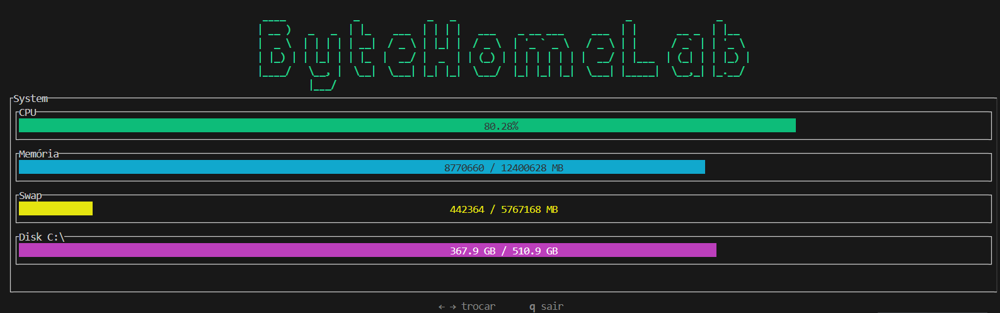
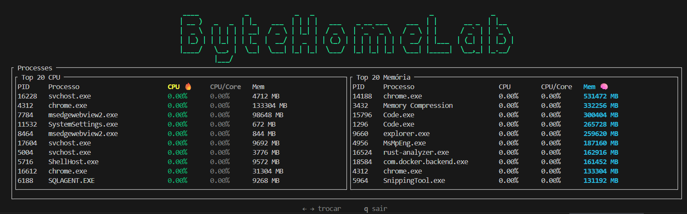
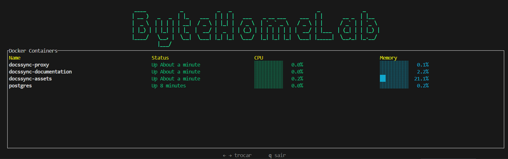

# 🚀 RackTop


RackTop é um monitor de sistema moderno em Terminal (TUI) escrito em
**Rust**, utilizando:

-   🖥 ratatui
-   ⚡ crossterm
-   🐳 Integração com Docker via CLI
-   📊 sysinfo

Ele fornece monitoramento em tempo real de:

-   Uso de CPU
-   Uso de Memória
-   Uso de Swap
-   Partições de disco (Windows e Linux)
-   Containers Docker (status, CPU %, Memória %)

<p align="center">
  
</p>
<p align="center">
  
</p>
<p align="center">
  
</p>
------------------------------------------------------------------------

## ✨ Funcionalidades

### 🖥 Aba Sistema

-   Gauge de uso de CPU
-   Gauge de uso de Memória
-   Gauge de uso de Swap
-   Partições de disco (similar ao `df -h`)
-   Detecção automática multiplataforma

### 🐳 Aba Docker

-   Lista containers em execução
-   Mostra status do container
-   Exibe uso de CPU %
-   Exibe uso de Memória %
-   Containers coloridos (running / exited)

### 🎮 Controles

  Tecla     Ação
  --------- -----------------------------
  ← →       Alternar abas
  q / Esc   Sair
  r         Atualizar (se implementado)

------------------------------------------------------------------------

## 📦 Instalação

### 1️⃣ Clonar o repositório

``` bash
git clone https://github.com/patrickcaloriocarvalho/RackTop.git
cd RackTop
```

### 2️⃣ Compilar

``` bash
cargo build --release
```

### 3️⃣ Executar

``` bash
cargo run --release
```

------------------------------------------------------------------------

## 🐳 Requisitos do Docker

Para habilitar o monitoramento Docker:

-   Docker precisa estar instalado
-   O daemon do Docker deve estar rodando
-   O comando `docker` deve estar disponível no PATH

Teste com:

``` bash
docker version
```

------------------------------------------------------------------------

## 🛠 Estrutura do Projeto

    src/
     ├── main.rs
     ├── app.rs
     ├── metrics.rs
     ├── docker.rs
     ├── ui/
     │    ├── mod.rs
     │    ├── layout.rs
     │    ├── tab_system.rs
     │    ├── tab_docker.rs
     │    └── tab_processes.rs

------------------------------------------------------------------------

## 📊 Roadmap

-   [ ] Start/Stop de containers pela interface
-   [ ] Lista de processos estilo top
-   [ ] Tabelas com scroll
-   [ ] Ordenação por CPU/Memória
-   [ ] Gráficos históricos
-   [ ] Integração assíncrona com Docker (bollard)
-   [ ] Temas (Cyberpunk / Matrix mode)

------------------------------------------------------------------------

## 🧠 Por que RackTop?

RackTop foi pensado para ser:

-   Leve
-   Multiplataforma
-   Amigável para desenvolvedores
-   Extensível
-   Alternativa moderna em TUI para htop + docker stats

------------------------------------------------------------------------

## 📜 Licença

Licença MIT

------------------------------------------------------------------------

## 👨‍💻 Autor

Desenvolvido com Rust ❤️

Se você gostou do projeto, considere dar uma ⭐ no GitHub!
